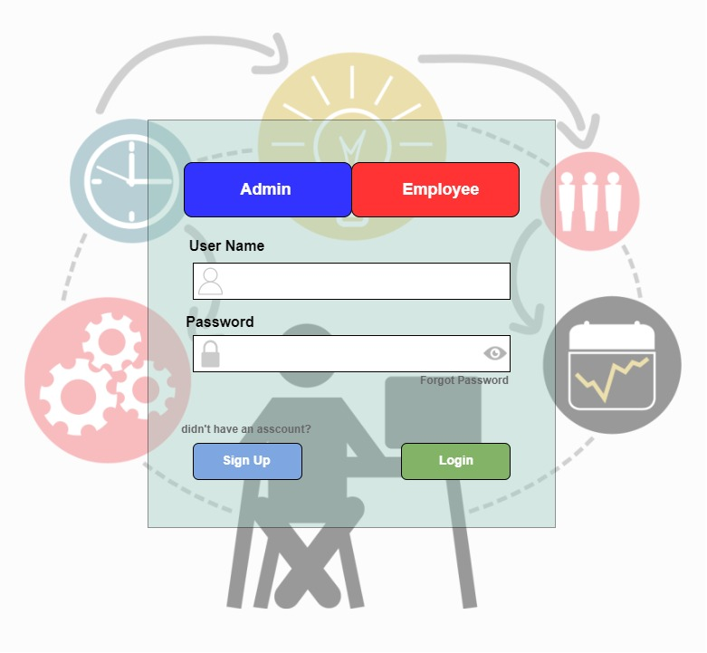

# Task-Management-System

This repo contains the small scale Employee Task Management System. where the user can assign task to its team members the team members the team mebers can view the tasks on the app and are notified once a new task is assigned.
the program is made on python backend and the frontend of the application is designed using python gui called Kivy and KivyMD

the Login Screen looks something like this

this is my first python program that I created, other screenshots of different screens are also attached in the screeshots folder
